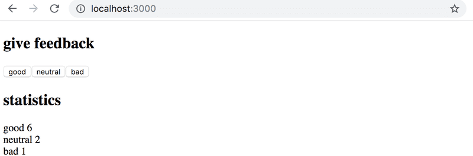

Like most companies, the student restaurant of the Unicafe collects feedback from its customers. My task is to implement a web application for collecting customer feedback. There are only three options for feedback: good, neutral, and bad.

The application must display the total number of collected feedback for each category. Final application look like this:
